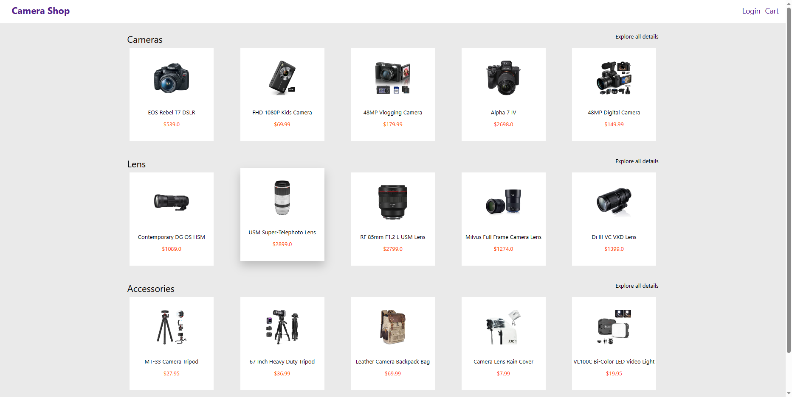
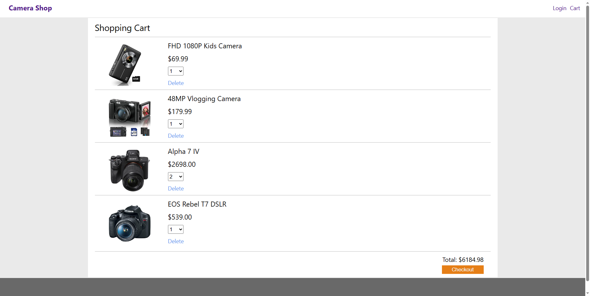
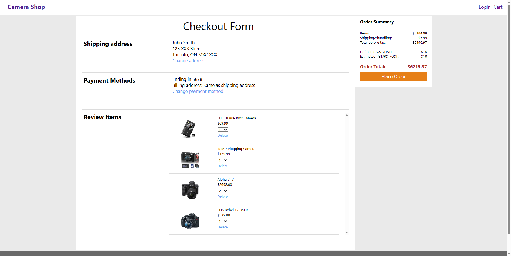

# Camera Shop
## Introduction 
This project is currently under development, originates from a lab assignment in EECS3421, is an e-commerce website utilizing React, Django and MySQL database. It will provide functions such as product display, shopping cart, and order management.
## Features
- Cart and checkout: This module is responsible for processing the user's shopping cart content, settlement amount, payment method, shipping address, and other information, as well as completing the submission and confirmation of orders.
- Product Information Management: This module is responsible for storing and managing various data of products, such as names, prices, classifications, descriptions, images, inventory, ratings, etc., as well as providing search, filtering, sorting, and other functions for products. 
- Order Management: This module is responsible for tracking and processing the user's order status, such as pending payment, paid, shipped, received, etc., as well as providing functions such as viewing, modifying, canceling, returning, and exchanging orders. 
## Project Preview
This project is still in progress, and the following are some completed pages.
### Home

This is the homepage, displaying the latest product and discount information. 

### Cart
This is the shopping cart page where users can view and modify their order. This page also has a dynamic update function, which means that when users modify the number of items or delete items, the total price on the page will immediately change, making it easier for users to control their consumption.

### Checkout Page
This is the checkout page, users can choose their payment method, their address, and make final decision before placing the order.

## License
This project is licensed under the Apache-2.0 license - see the LICENSE file for details.
